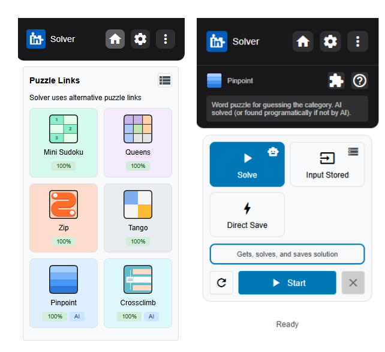

# LinkedIn Solver

A collection of automated solvers for all of the LinkedIn games including Mini Sudoku, Queens, Zip, Tango, Pinpoint, and Crossclimb. There are two versions for each solver, a Chrome browser extension using HTML, CSS, and JS, and stand alone browser automation scripts using Playwright. Used OpenAI for puzzle solving where applicable.

## Features

- Chrome browser extension
- Stand alone scripts for solving each puzzle
- Mini Sudoku puzzle solver
- Queens puzzle solver
- Zip puzzle solver
- Tango puzzle solver
- Pinpoint puzzle solver
- Crossclimb puzzle solver



## Prerequisites

- Node.js (v14 or higher)
- npm (Node Package Manager)
- A LinkedIn account (for entering scores if desired)
- OpenAI API key (for AI-assisted solving). All puzzles are possible to solve without API key

## Installation

1. Clone the repository:
```bash
git clone https://github.com/origamiBoy/linkedin-game-solver.git
cd linkedin-game-solver
```

2. Install dependencies:
```bash
npm install
```

3. Create a `.env` file in the root directory and add your OpenAI API key (this location is only used for the stand alone scripts):
```
OPENAI_API_KEY=your_api_key_here
```

## Browser Extension

The project includes a Chrome extension that can be used to solve puzzles directly in the browser. To use the extension:

1. Open Chrome and go to `chrome://extensions/`
2. Enable "Developer mode"
3. Click "Load unpacked" and select the project directory
4. The extension icon will appear in your browser toolbar

## Script Usage

Each puzzle solver can be run using npm scripts:

### Mini Sudoku Solver
```bash
npm run start:mini-sudoku
```

### Queens Solver
```bash
npm run start:queens
```

### Zip Solver
```bash
npm run start:zip
```

### Tango Solver
```bash
npm run start:tango
```

### Pinpoint Solver
```bash
# Get new solution (AI, defaults to direct if fails)
npm run start:pinpoint:get

# Use stored solution
npm run start:pinpoint:stored

# Get direct solution (no AI)
npm run start:pinpoint:direct

# Default solver (Get)
npm run start:pinpoint
```

### Crossclimb Solver
```bash
# Get new solution (AI)
npm run start:crossclimb:get

# Use stored solution
npm run start:crossclimb:stored

# Get direct solution (no AI)
npm run start:crossclimb:direct

# Default solver (Get)
npm run start:crossclimb
```

## How it Works

### Queens/Zip/Tango/Mini Sudoku Solver
- Parses the board for current configuration
- Uses depth-first search to find puzzle solutions
- Automatically clicks appropriate cells to input solution

### Pinpoint/Crossclimb Solvers
- Uses OpenAI or hints to analyze and solve word-based puzzles
- Employs direct methods to get solutions without solving or AI
- Implements multiple attempts with different strategies
- Stores successful solutions for future use
- Can use stored solutions to more quickly input solved puzzles

## Notes

- Intended to be used through the browser extension as it has more features
- OpenAI-based solvers require an OpenAI API key
- Inputting stored solutions require up-to-date stored solutions
- Browser extension has stored solutions in local storage along with API key
- Script solvers automatically close browser tab 5 seconds after finished executing
- Script solutions are cached in JSON files for future use

## Contributing

Not currently accepting contributions, however feel free to clone it and make it your own.

## License

This project is licensed under the MIT License - see the LICENSE file for details. 